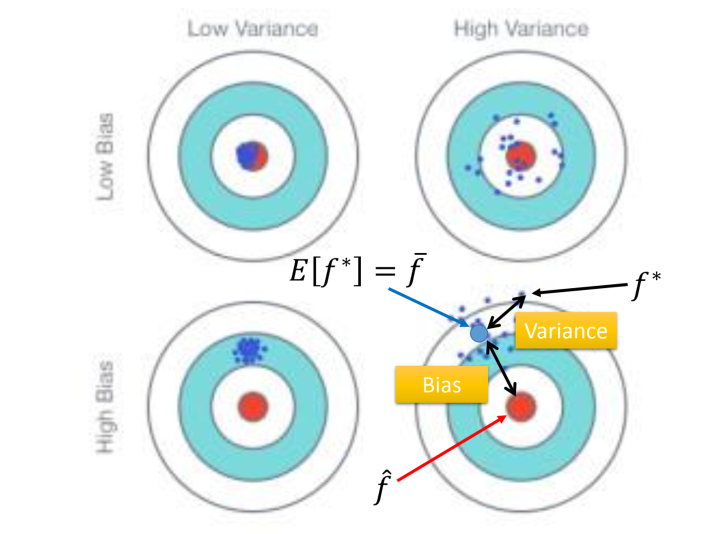

## Regression

### ML的三个步骤

1. Model：定义一个model即function set，通常从最简单的线性函数开始逐渐加级数
2. Goodness of Function：定义一个损失函数（Loss Function）去评估model的好坏
3. 选择Best Function（Gradient Descent）

#### Step1：模型假设

假设 **线性模型 Linear model**：$y=b+∑w_{i}x_{i}$

$x_{i}$：各种特征值，身高、体重、种类等

$w_{i}$：每个特征值的权重

$b$：偏移量

后续以单个特征$x_{cp}$的线性模型为例，即模型为：$y=b+w\cdot x_{cp}$

#### Step2：模型评估

定义损失函数：

$L(f)=\sum^{10}_{n=1}(\hat{y}^{n}-f(x^{n}_{cp}))^{2}$

等价于 $L(w,b)=\sum^{10}_{n=1}(\hat{y}^{n}-(b+w\cdot x^{n}_{cp}))^{2}$

即：真实值-估计值

则当前目标为：选择一个在训练集上最优的model $f^{*}$如下：

$f^{*}=\arg \min _{f} L(f)$
等价于 $w^{*}, b^{*}=\arg \min _{w, b} L(w, b)= \arg \min _{w, b}(\hat{y}^{n}-(b+w\cdot x^{n}_{cp}))^{2}$

<u>**理解**：这个问题可以通过多元方程、最小二乘等方法求得参数值，但利用Gradient Descent方法可以处理所有可微分的$L()$</u>

#### Step3：最佳模型（Gradient Desent）

一、对于只有一个参数的$L(w)$，$w^{*}=\arg \min _{w} L(w)$

1. 随机选择一个初始值$w_{0}$
2. 计算$\left.\frac{d L}{d w}\right|_{w=w^{0}}$
3. $w^{1} \leftarrow w^{0}-\left.\eta \frac{d L}{d w}\right|_{w=w^{0}}$，  $\eta$：learning rate
4. 计算$\left.\frac{d L}{d w}\right|_{w=w^{1}}$
5. $w^{2} \leftarrow w^{1}-\left.\eta \frac{d L}{d w}\right|_{w=w^{·}}$，  $\eta$：learning rate
6. 持续迭代……

<u>**理解**：斜率为负→最优点在当前点右侧→增加$w$</u>

​			<u>斜率为正→最优点在当前点左侧→减少$</u>w$

​			<u>对于曲线可能到达局部最优解，但对于Linear Regression中损失函数是凸的，一定可以找到最优解</u>

二、对于只有多参数的$L(w,b)$，$w^{*},b^{*}=\arg \min _{w,b} L(w,b)$

1. 随机选择一个初始值$w_{0},b_{0}$
2. 计算$\left.\frac{\partial L}{\partial w}\right|_{w=w^{0}, b=b^{0}}$，$\left.\frac{\partial L}{\partial b}\right|_{w=w^{0}, b=b^{0}}$
3. $w^{1} \leftarrow w^{0}-\left.\eta \frac{\partial L}{\partial w}\right|_{w=w^{0}, b=b^{0}}, b^{1} \leftarrow b^{0}-\left.\eta \frac{\partial L}{\partial b}\right|_{w=w^{0}, b=b^{0}}$  ,     $\eta$：learning rate
4. 计算$\left.\frac{\partial L}{\partial w}\right|_{w=w^{1}, b=b^{1}}$，$\left.\frac{\partial L}{\partial b}\right|_{w=w^{1}, b=b^{1}}$
5. $w^{2} \leftarrow w^{1}-\left.\eta \frac{\partial L}{\partial w}\right|_{w=w^{1}, b=b^{1}}, b^{2} \leftarrow b^{1}-\left.\eta \frac{\partial L}{\partial b}\right|_{w=w^{1}, b=b^{1}}$  ,      $\eta$：learning rate
6. 持续迭代……

此时gradient为：$\nabla L= \left[\begin{array}{l}\frac{\partial L}{\partial w} \\ \frac{\partial L}{\partial b}\end{array}\right]$

### 性能验证

计算testing data和模型输出之间的ave error

得到次数从1-5的五个model的error如下：

**注**：由于高次数model可以表示低次数model，高次数model的function space包含低次数model的function space

则不同model在训练集和测试集上的error如下：

如上，高次数model在测试集上过拟合，可见需要增加数据（发掘更多特征）

### 步骤优化

#### Step1优化：先修改模型，考虑多种feature

$y=\sum^{4}_{i=1}(b_{i}+\delta(x_{s}=i)w_{i}x_{cp}) $

$x_{s}=i$：代表4个物种类型

注：如果考虑了物种特征之后还在测试集上效果不好，则增加特征（身高、体重……）

#### **Step2优化：若增加数据后扔过拟合，则Regularization：**

修改Loss Functionn如下：

$L=\sum_{n}(\hat{y}^{n}-(b+\sum w_{i}x_{i}))^{2}+\lambda\sum(w_{i})^{2} $

| **$\sum_{n}(\hat{y}^{n}-(b+\sum w_{i}x_{i}))^{2}$** | **error** |
| --------------------------------------------------- | --------- |
| $\lambda\sum(w_{i})^{2}$                            | smooth    |

$\lambda$为常数，自己设置

**对smooth的解释：**

当输入增加$\Delta x_{i}$时，输出增加$w_{i}\Delta x_{i}$，则$\lambda\sum(w_{i})^{2}$项越小，输出对于输入的变化越不敏感，function越平滑，干扰的影响越小

### 正则化结果

可以看出：

$\lambda$越大，**训练集**的损失函数越倾向于考虑smooth而不管error，则error越大

$\lambda$越大，**测试集**先抗干扰，error减小，后对于error不敏感，则error越大

### Bias and Variance

数据和best function输出之间的error包含：bias和variance

#### Bias和variance的估计

假设随机变量$x$的均值和方差为$(\mu,\sigma^{2})$，样本为$\{x^{1},x^{2},\dots x^{N} \}$

$m=\frac{1}{N} \sum_{n} x^{n}$，$ s^{2}=\frac{1}{N} \sum_{n}\left(x^{n}-m\right)^{2}$

则：

$E[m]=E\left[\frac{1}{N} \sum_{n} x^{n}\right]=\frac{1}{N} \sum_{n} E\left[x^{n}\right]=\mu$

$Var[m]=\frac{\sigma^{2}}{N}$

$E[s^{2}]=\frac{N-1}{N}\sigma^{2}\ne \sigma^{2} $→大多数情况下$s^{2}<\sigma^{2}$

#### Bias和variance的区别

$\hat{f}$：最优函数（实际的靶心）

$f^{*}$：根据训练集得到的函数，由训练数据决定，每次可能不一样（每次射击的点）

$\bar{f}$：$f^{*}$的期望（训练时瞄准的靶心）

则：

**bias**：$\bar{f}$和$\hat{f}$之间的差距

**variance**：$f^{*}$和$\bar{f}$之间的差距

### 同一环境采集不同测试集的best function

#### Variance分析

模型越简单，variance越小

模型越复杂，variance越大

**总结：简单的模型更不容易受样本数据影响**

#### Bias分析

blue：$\bar{f}$

black：$\hat{f}$

可以看出：

模型越复杂，$\bar{f}$越接近$\hat{f}$，这是由于简单模型的function set较小，其space可能未包含$\hat{f}$

#### Bias和Variance的影响

简单模型：Bias大（Underfitting，欠拟合），Variance小

复杂模型：Bias小，Variance大（Overfitting，过拟合）

#### 如何解决Bias大

<u>Bias大的定义：model无法拟合训练集</u>

解决方法：

- 重新设计模型：增加特征参数、增加次数

#### 如何解决Variance大

<u>Variance大的定义：model可以拟合训练集但测试集error大</u>

解决方法：

- 增加数据：采集、自己制造（改造现有数据、生成新的数据……）
- Regularization：平滑化，在损失函数后加smooth，自己设置$\lambda$大小调整平滑程度，但这样调整了function space，可能损害bias

### Model选择步骤

Cross Validation步骤：

1. 用training set去训练所有model
2. 用Validation set去验证所有model的error
3. 接着用整个Training set在best model上apply
4. 此时public上的测试集error可以反映private上的测试集error

N-fold Cross Validation步骤：

